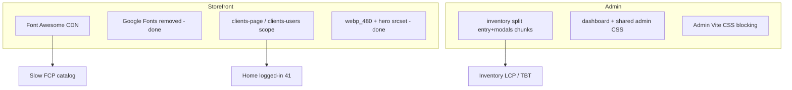

# Performance improvement plan (Lighthouse / Unlighthouse)

Based on scans run **2026-05-20** with `npm run build`, no `public/hot`, app at `http://localhost:8080`.

| Command | Output | Routes |
|---------|--------|--------|
| `npm run unlighthouse:auth` (parallel) | `./lighthouse-client/`, `./lighthouse-admin/` | Client crawler 80 URLs; admin 7 URLs |
| Guest (prior) | `./lighthouse/localhost/fec6/` | `/`, `/catalog`, `/product/20` |

Admin-only re-scan with DevTools cookies: `npm run unlighthouse:admin` (see `docs/UNLIGHTHOUSE.md` admin baseline, `./lighthouse-admin/localhost/25c7/`).

---

## Summary scores

### Guest (public, mobile) — baseline after CF4-133 + storefront split

| Route | Performance | LCP | Payload |
|-------|-------------|-----|---------|
| `/` | **72** | 4.7 s | ~598 KiB |
| `/catalog` | **81** | 3.5 s | ~658 KiB |
| `/product/20` | **85** | 2.8 s | ~571 KiB |

### Client (authenticated, mobile, crawler)

| Route | Performance | LCP | Notes |
|-------|-------------|-----|-------|
| `/` (home) | **41** | 4.9 s | Worst route; TBT / max-potential-fid ~1.1 s |
| `/catalog` | **73** | 3.7 s | render-blocking ~660 ms; image-delivery ~33 KiB |
| Filtered catalog variants | 92–99 | 1.1–2.0 s | Crawler noise; small payloads |
| `/cart`, `/profile` | — | — | Not reached (80-route cap on catalog variants) |

**Insight:** Logged-in **home regresses** vs guest home (41 vs 72) — extra header/account JS or session-specific markup.

### Admin (desktop, 7 URLs) — 2026-05-21 authenticated scan

| Route | Performance | FCP | Payload (document) |
|-------|-------------|-----|-------------------|
| `/dashboard` | **66** | 3.0 s | ~667 KiB |
| `/inventory` | **82** | 1.9 s | ~96 KiB |
| `/orders` | **84** | 0.9 s | ~29 KiB |
| `/sales` | **83** | 0.7 s | ~8 KiB HTML |
| `/reports` | **98** | 0.9 s | ~13 KiB |
| `/reports/desempeno-ventas` | **97** | 1.0 s | ~14 KiB |
| `/reports/productos-vendidos` | **95** | 0.9 s | ~16 KiB |

All routes had correct `finalUrl` (not `/admin/login`). **`/dashboard`** remains the main optimization target (largest payload).

### Admin metrics focus (FCP / LCP / SI / CLS)

Lighthouse flagged **render-blocking** Font Awesome + Google Fonts on every admin layout (~450–760 ms est. savings) and **layout shifts** on `.filters-section` (sales/orders), `.orders-table-card`, and dashboard `.charts-section`.

**Applied (2026-05-21):**

- `resources/css/admin/shell-base.css` — self-hosted Poppins (`@fontsource`) + Font Awesome via Vite (no cdnjs/googleapis).
- `resources/ts/admin/shell.ts` — prefetch SweetAlert2 on idle (replaces blocking CDN `<script>`).
- Dashboard: Chart.js init deferred with `requestIdleCallback` so header/KPIs paint before the chart bundle.
- CLS guards: `min-height` + `contain: layout` on filters, orders table card, charts section.

Re-scan: `npm run build && npm run unlighthouse:admin`.

---

## Root causes (by Lighthouse category)



| Audit | Guest | Client | Admin |
|-------|-------|--------|-------|
| `render-blocking-insight` | ~800 ms catalog | ~660 ms catalog | ~2.4 s (login shell) |
| `total-byte-weight` | ~600 KiB | ~600–660 KiB | ~790 KiB heavy pages |
| `unused-javascript` | Low on home | ~22 KiB catalog | High on inventory (inspect after valid scan) |
| `image-delivery-insight` | Hero ~66 KiB mobile | ~33 KiB catalog cards | N/A |
| `bootup-time` | OK on home | OK | Dominated by inventory bundle |

---

## Phase 0 — Measurement hygiene (do first)

1. **Admin scan solo** — done 2026-05-21 (`./lighthouse-admin/localhost/25c7/`). Re-run after cookie expiry:
   ```bash
   npm run unlighthouse:admin
   ```
   Confirm `finalUrl` is not `/admin/login` in `./lighthouse-admin/`.

2. **Client: fixed URL list** in [`unlighthouse.client.config.ts`](../unlighthouse.client.config.ts) — disable crawler; scan only:
   - `/`, `/catalog`, `/cart`, `/profile`, `/pedidos` (or invoices route), one `/product/{id}/…`

3. **Optional:** `run-auth.sh` run admin then client **sequentially** to avoid Puppeteer cookie race.

4. Keep **one `APP_KEY`** in [`.env`](../.env).

---

## Phase 1 — Storefront (client + guest)

| Priority | Task | Expected impact | Files |
|----------|------|-----------------|-------|
| P1 | **Font Awesome** — self-host subset or `@fortawesome` tree-shaken build | −500–800 ms render-blocking on catalog | [`app.blade.php`](../resources/views/client/layouts/app.blade.php), Vite |
| P1 | **Home logged-in (41)** — audit why worse than guest: cart badge polling, `clients-users` remnants, third-party scripts | +15–25 perf points on `/` | [`clients-header.js`](../resources/ts/client/clients-header.ts), [`home.blade.php`](../resources/views/client/home.blade.php) |
| P2 | **Catalog** — ensure `clients-page.js` only on catalog/product/cart; Swiper stays dynamic import | Stable ~81+ on catalog | [`catalog.blade.php`](../resources/views/client/catalog.blade.php) |
| P2 | **Cart / profile** — measure after explicit URLs; defer SweetAlert2 until needed | — | layout + per-page `@vite` |
| P3 | Hero `image-delivery` ~66 KiB on mobile | Minor LCP win on guest `/` | [`home.blade.php`](../resources/views/client/home.blade.php) |

**Targets:** guest `/` ≥ 75, `/catalog` ≥ 85; client home ≥ 60, catalog ≥ 80.

---

## Phase 2 — Admin panel

| Priority | Task | Expected impact | Files |
|----------|------|-----------------|-------|
| P1 | **Code-split `inventory.js`** — modals, PDF export, classification UI via `import()` | −200–400 KiB initial JS on `/inventory` | [`inventory.js`](../resources/ts/admin/inventory/inventory.ts) |
| P1 | **Per-page Vite entries** — do not load inventory bundle on dashboard/orders | Lower payload on dashboard | admin Blade views, [`vite.config.js`](../vite.config.js) |
| P2 | **Admin CSS** — shared critical CSS in layout; defer report-specific CSS | render-blocking −1–2 s | [`resources/css/admin/`](../resources/css/admin/) |
| P2 | **Charts** — load Chart.js only on dashboard/reports pages | bootup-time ↓ on inventory | dashboard JS |
| P3 | Lazy-load DataTables / heavy tables if present | TBT ↓ | inventory views |

**Targets (after valid scan):** `/dashboard` ≥ 55, `/inventory` ≥ 50 (desktop, local); `/sales` already 56 with small payload.

---

## Phase 3 — Infrastructure

| Task | Notes |
|------|-------|
| `Cache-Control` for `/build/`, `/assets/` | Staging/production; helps repeat visits |
| Re-scan on staging with throttling | Localhost LCP inflated vs real users |
| CI: `unlighthouse:guest` only | No secrets; optional threshold perf ≥ 70 on `/` |

---

## Verification checklist

- [ ] `curl` admin cookies → 200 on `/dashboard`
- [ ] `npm run unlighthouse:admin` — 7 URLs, no LOGIN in `finalUrl`
- [ ] Client explicit URLs — includes `/cart`, `/profile`
- [ ] Guest `npm run unlighthouse:guest` — regression guard
- [ ] Manual smoke: home carousel, catalog filters, inventory CRUD, sales list

---

## Commands reference

```bash
npm run build && rm -f public/hot
npm run unlighthouse:auth      # parallel admin + client
npm run unlighthouse:admin     # admin only (recommended)
npm run unlighthouse:guest     # public storefront
```

Cookies: [`.env.unlighthouse.local`](../.env.unlighthouse.example) — refresh when session expires.
